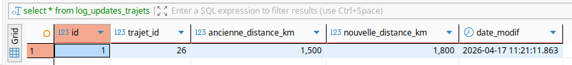
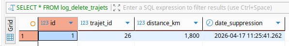

# EcoTrack Logistics - Projet fil rouge

Lancer le docker compose : docker compose up -d
Stoper les processus : docker compose down

# Questions TP1 : 

1/ Les données SQL sont-elles toujours présentes ? : Oui 

# Questions TP2 :

2. Analyse
Quels sont les problèmes potentiels ?
- Redondance d’informations
- Difficulté de mise à jour
- Risque d’incohérence

3. Normalisation
Quel Problème ?
- Si on change un conducteur on aura des modifications multiples
- Donnée dupliquée

5. Le Challenge de l’Ingénieur
Que se passe-t-il si on supprime un entrepôt utilisé ?
On a une erreur de contrainte
Est-ce toujours une bonne idée ?
Non ce n'est pas une bonne idée ça peut créer des problèmes de cohérences des données.


# Question TP3 : 

Partie 4/ 

Quel résultat avez-vous obtenu ?
SQL Error [42501]: ERROR: must be owner of table entrepots

Pourquoi cette opération est-elle interdite ?
Parce que l’utilisateur readonly n’a que des droits de lecture. Il ne peut ni modifier ni supprimer des tables. La commande DROP TABLE est donc refusée.

Quel principe de sécurité est appliqué ?
Le principe du moindre privilège : chaque rôle ne reçoit que les droits nécessaires, rien de plus. readonly = lecture uniquement.

# Question TP4 :

>Partie 4 :

Comment se comporte l’insertion ?
Une fois l'insertion faite il me renvoi une erreur puisque au préalable, j'ai fait une fonction de validation où on peut
pas entrée une valeur inférieur ou égale à 0 pour le champ distance_km du coup la fonction check_distance() se déclenche
et dans DBeaver ça me renvoie ça : SQL Error [P0001]: ERROR: Distance invalide
                                   Where: PL/pgSQL function check_distance() line 4 at RAISE

> Partie 5 :

Créer un trigger qui :
● empêche un trajet > 2000 km
● log l’erreur

>Les fonctions :

```
CREATE OR REPLACE FUNCTION distance_inf_2000()
RETURNS TRIGGER AS $$
BEGIN
IF NEW.distance_km > 2000 THEN
INSERT INTO log_erreurs_distance (trajet_id, message)
VALUES (NEW.id, 'Distance invalide : ' || NEW.distance_km);
RAISE EXCEPTION 'Distance invalide : % km', NEW.distance_km;
END IF;
RETURN NEW;
END;
$$ LANGUAGE plpgsql;
```

```
CREATE OR REPLACE FUNCTION log_erreurs_distance()
RETURNS TRIGGER AS $$
BEGIN
INSERT INTO log_erreurs_distance (trajet_id, message)
VALUES (NEW.id, 'Distance invalide : ' || NEW.distance_km || ' km');
RETURN NEW;
END;
$$ LANGUAGE plpgsql;
```

> Les triggers : 

```
CREATE TRIGGER trg_distance_inf_2000
BEFORE INSERT OR UPDATE ON trajets
FOR EACH ROW
EXECUTE FUNCTION distance_inf_2000();
```

```
CREATE TRIGGER trg_log_erreurs_distance
AFTER INSERT OR UPDATE ON trajets
FOR EACH ROW
WHEN (NEW.distance_km > 2000)
EXECUTE FUNCTION log_erreurs_distance();
```

> Partie 6 :

● Ajouter UPDATE trigger

```
CREATE OR REPLACE FUNCTION log_update_trajet()
RETURNS TRIGGER AS $$
BEGIN
INSERT INTO log_updates_trajets (trajet_id, ancienne_distance_km, nouvelle_distance_km)
VALUES (OLD.id, OLD.distance_km, NEW.distance_km);
RETURN NEW;
END;
$$ LANGUAGE plpgsql;
```

```
CREATE TABLE IF NOT EXISTS log_updates_trajets (
    id SERIAL PRIMARY KEY,
    trajet_id INT,
    ancienne_distance_km INT,
    nouvelle_distance_km INT,
    date_modif TIMESTAMP DEFAULT CURRENT_TIMESTAMP
);
```

```
CREATE TRIGGER trg_log_update_trajet
AFTER UPDATE ON trajets
FOR EACH ROW
EXECUTE FUNCTION log_update_trajet();
```

Voila ce que ça donne après un update d'un trajet



● Gérer DELETE

```
CREATE TABLE IF NOT EXISTS log_delete_trajets (
    id SERIAL PRIMARY KEY,
    trajet_id INT,
    distance_km INT,
    date_suppression TIMESTAMP DEFAULT CURRENT_TIMESTAMP
);
```

```
CREATE OR REPLACE FUNCTION log_delete_trajet()
RETURNS TRIGGER AS $$
BEGIN
    INSERT INTO log_delete_trajets (trajet_id, distance_km)
    VALUES (OLD.id, OLD.distance_km);

    RETURN OLD;
END;
$$ LANGUAGE plpgsql;
```

```
CREATE TRIGGER trg_log_delete_trajet
BEFORE DELETE ON trajets
FOR EACH ROW
EXECUTE FUNCTION log_delete_trajet();
```

Voila ce que donne les logs après le delete d'un trajets



● Ajouter gestion d’erreurs avancée

Pour cette partie la, on la fait dans la partie 5 où on a créer une fonction qui interdit d'avoir une distance d'un trajet supérieur à 2000 km sinon ça renvoie une erreur 

> Questions de réfléxion

● Pourquoi mettre la logique dans la base ?

Pour éviter les erreurs et être sûr que les règles sont toujours respectées, peu importe l’application qui utilise la base. Ça permet aussi d’automatiser certaines actions directement côté base.

● Quel impact sur la performance ?

Ça peut ralentir les INSERT / UPDATE / DELETE, car la base doit exécuter du code en plus à chaque fois. Plus il y a de triggers, plus ça peut devenir lourd.

● Quand éviter les triggers ?

Quand la logique est trop complexe ou quand elle peut être faite plus simplement dans le backend. Aussi quand ça rend la base difficile à comprendre ou à maintenir.