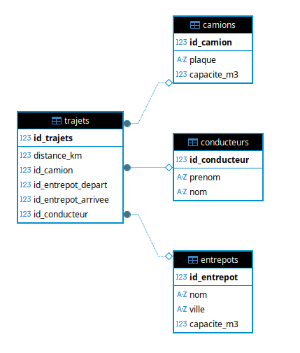
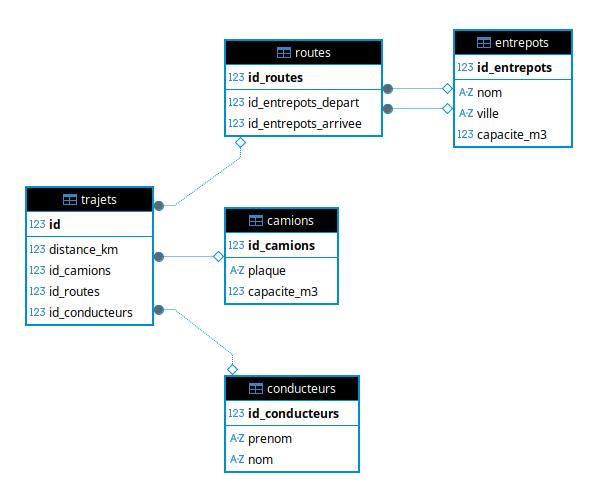

# EcoTrack Logistics - Projet fil rouge

Lancer le docker compose : docker compose up -d
Stoper les processus : docker compose down

# Questions TP1 : 

1/ Les données SQL sont-elles toujours présentes ? : Oui 
2/ Les données MongoDB sont-elles toujours présentes ? :
3/ Pourquoi ?

# Questions TP2 :

2. Analyse
Quels sont les problèmes potentiels ?
- Redondance d’informations
- Difficulté de mise à jour
- Risque d’incohérence

3. Normalisation
Quel Problème ?
- Si on change un conducteur on aura des modifications multiples
- Donnée dupliquée

5. Le Challenge de l’Ingénieur
Que se passe-t-il si on supprime un entrepôt utilisé ?
On a une erreur de contrainte
Est-ce toujours une bonne idée ?
Non ce n'est pas une bonne idée ça peut créer des problèmes de cohérences des données.

# Question TP3 : 

Partie 4/ 

Quel résultat avez-vous obtenu ?
SQL Error [42501]: ERROR: must be owner of table entrepots

